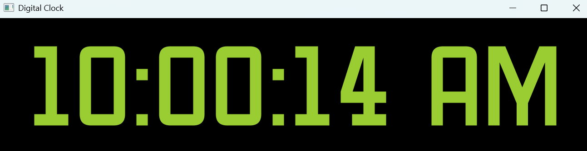

# 🕰️ Digital-Clock
A sleek digital clock desktop application built with Python and PyQt5, featuring a custom font and modern styling.

## 📌 Features

- Real-time digital clock display with hour, minute, and second precision
- Custom font support using the "Oldtimer.ttf" font file
- Modern dark theme with black background and yellow-green text
- Responsive layout that centers the clock display
- Auto-updating every second using QTimer
- 12-hour format with AM/PM indicator

## 🖥️ Screenshot



The application displays a large, easy-to-read digital clock with:

- 200px font size for excellent visibility
- Custom "Oldtimer" font for a unique aesthetic
- Yellow-green text on black background
- Centered alignment in a 500x300 window

## Prerequisites
Before running this application, make sure you have:

- PyQt5 library installed
- The Oldtimer.ttf font file in the same directory as the script

# 🛠️ How to Run
Download the digital-clock.py file from this repository.

Install PyQt5 if it's not already installed:
```
pip install PyQt5
```

Open a terminal in the folder where you saved the file.

Run the clock using:
```
python digital-clock.py
```

Ensure you have the font file:
Make sure Oldtimer.ttf is in the same directory as your Python script.

If you don't have this font, you can:

- Download it from a font repository
- Replace it with any other .ttf font file of your choice
- Comment out the custom font code to use the system default

